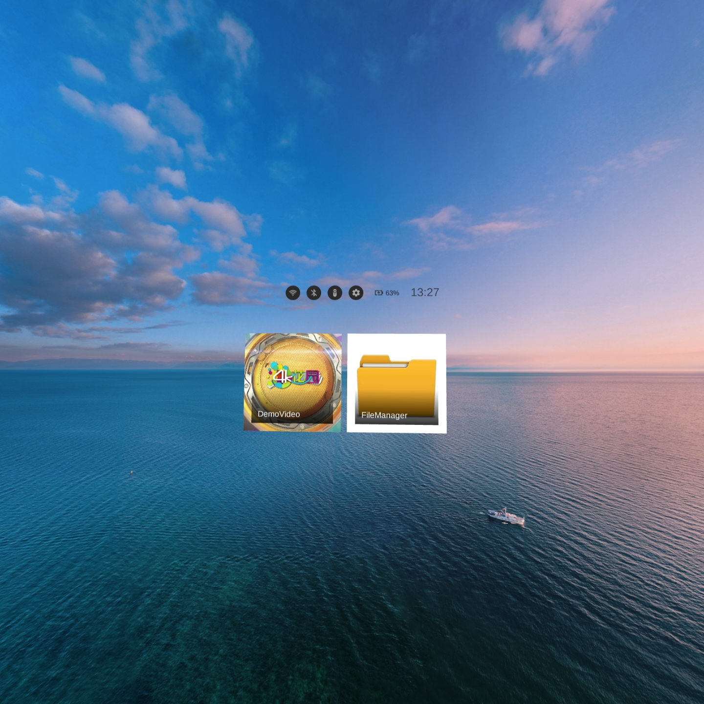

# Launcher-Demo-UnityXR

- If you have any questions/comments, please visit [**Pico Developer Answers**](https://devanswers.pico-interactive.com/) and raise your question there.

## Environment：

- Unity 2019.4.24f1c1
- Unity XR SDK v2.0.1

## Applicable devices:

- Neo 3 series

## Description:

This demo is for developers' reference on how to implement their own launcher. It contains wifi connection status, bluetooth connection status, controller connection status, VR settings, battery indicator, time indicator and app icons.

 

## Usage:

Scene: Assets->Project->Scene->Scene

## Note:
The Unity XR SDK v2.0.1 needs to be imported manually. For details about the latest SDK download address and documentation, see the following links:
https://developer.pico-interactive.com/sdk

